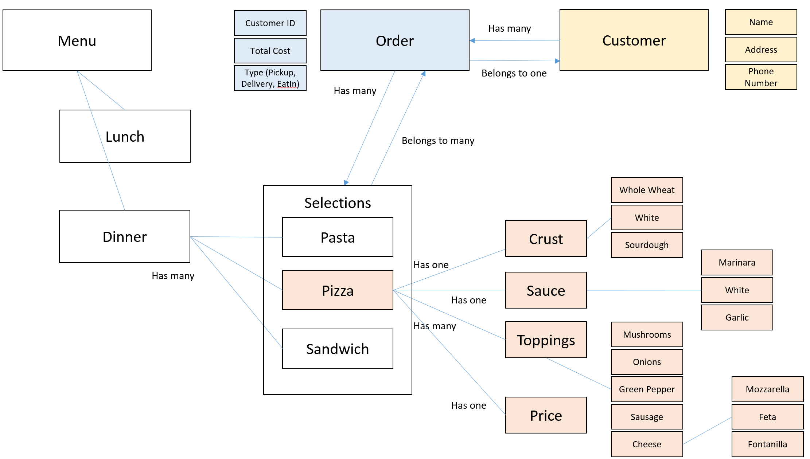

# README

## Sid Benavente
### pizza, an epicodus learning project
[Click](https://rubybe.github.io/pizza/) to see view the html version of this project.

#### Business Specs for the project

##### Entity:Relationship Diagram

* It can create a new customer object
  * **Example input:** new Customer
  * **Example output:** "Dr. Gonzo", "2000 2nd Avenue, #5, Seattle", "206-555-1212"

* It can create a new order
  * **Example input:** new Order
  * **Example output:** "CustomerID = 1", "Delivery"

* It can add a pizza to an order
  * **Example input:** new Pizza
  * **Example output:** "Whole Wheat", "Garlic", "Mushrooms, Onions, Green Pepper, Sausage, Mozzarella"

* It can calculate the cost of a pizza, add sales tax and delivery charge
  * **Example input:** new Pizza
  * **Example output:** "Whole Wheat", "Garlic", "Mushrooms, Onions, Green Pepper, Sausage, Mozzarella, $27.65"
